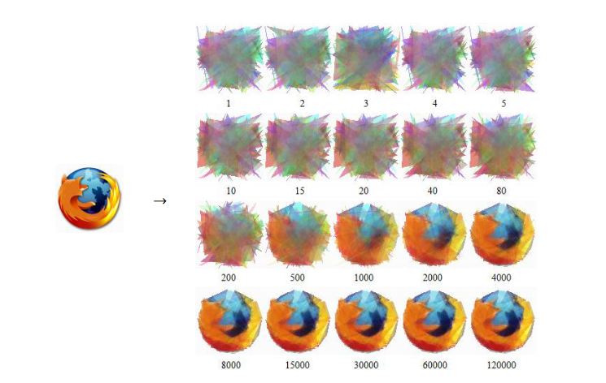

# PicGene

### MENSAH-ASSIAKOLEY Seer 

##### Idée generale

Ce programme essaie d’approximer une image donnée par des triangles transparents. 

#### *Processus*
Il commence par lire les données de l’image dans une entité de la bibliothèque MLV nommée MLV_Image. Puis, le programme applique un algorithme génétique sur des entités appelés “amibe” (amoeba en anglais) dans le code, chacune représent un ensemble de nombre fixé de gènes, qui sont des triangles transparents. L’algorithme génétique dans ce code prend plusieurs étapes : 
- Constituer une population d’individu aléatoires, qui forme la génération initiale.
- Pour la génération courante, on évalue chaque individu. Puis on divise les individus en trois tiers par leur évaluation. Les tiers sont numérotés 1, 2 et 3, avec le tier 1 le meilleur et le tier 3 le pire.
- On vire tous les individus du tier 3, et recopier les individus du tier 1 dans l’espace libéré. Puis on fait des accouplements pour chaque nouvel individu, en prenant un individu aléatoire dans le tier 2, duquel on recopie un nombre fixé de gènes aléatoires.
- Après avoir généré tous les individus, chaque gène dans chaque individu a une chance faible de muter, en changeant ses paramètres (coordonnées des trois sommets, les composantes de couleur).
- On revient à l’étape 2 jusqu’à avoir itérer sur un nombre de générations donné. Le nombre de générations est entré par l’utilisateur au début de l’exécution du programme. 
 
**Le format utilisé dans le MLV_Image est définie dans la documentation de la bibliothèque MLV : [MLV_Image](http://www-igm.univ-mlv.fr/~boussica/mlv/api/French/html/MLV__image_8h_a652f0ebbbec1ceb685a9d47e8a1df414.html#a652f0ebbbec1ceb685a9d47e8a1df414)**


#### *Déroulement du code*

***Figure 1*** contient un exemple du meilleur individu aux générations différentes pendant une approximation pour l’ancien logo de <span style="color: #26B260">Firefox</span> avec **100 triangles transparents**. 



```
Figure 1: Exemple du meilleur individu aux générations différentes
```